# 0. Prerequisites

- First make sure to install example Docker images located in [docker-images](docker-images) directory.
- You can do it via standard Docker commands, or just run the devops file `update.sh` located in each subdirectory by running the command:
```bash
docker-images/hello-world/deploy.sh
docker-images/hello-world-v2/deploy.sh
docker-images/hello-world-v3/deploy.sh
docker-images/hello-world-v4/deploy.sh
microservices/deploy.sh
frontend/deploy.sh
```
- These two images will be used as examples for this Kubernetes learning documentation.

# 1. Getting Started

The goal here is to master Kubernetes from A to Z.

## 1.1. What is Kubernetes

Kubernetes is the world's most popular open-source container orchestration engine.

It offers the ability to schedule and manage containers.

### 1.1.1. Origin

- Originated from Google.
- Started with a system called Borg which allowed them to deploy billions of containers every week.
- From Borg, they developed Omega.
- From Omega, Kubernetes was born.
- Kubernetes is written in Golang.

### 1.1.2. Kubernetes AKA K8S

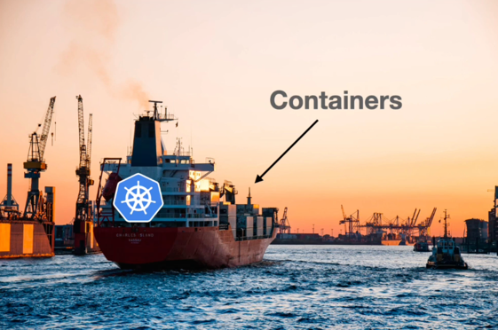

- Kubernetes means Helmsman or Pilot in Greek.
- You can imagine it as a ship carrying cargo (containers).
- Kubernetes, or K8S (8 because there are 8 letters between K and S in Kubernetes) is an application orchestrator.
- Basically, Kubernetes orchestrates all the applications.

### 1.1.3. Application Orchestrator

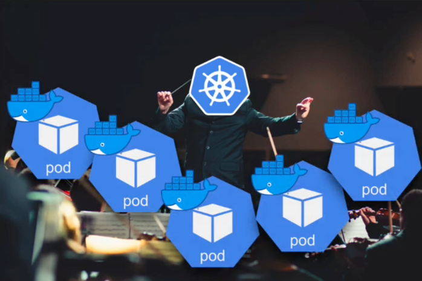

- When we are talking about applications, we mainly refer to **containers**.
- Kubernetes deploys and manages applications (containers).
- It also scales up and down according to demand.
- Performs zero downtime deployments.
- Allows rollbacks.
- Much more.

### 1.1.4. Cluster


- To understand how Kubernetes works, we first need to understand what a cluster is.
- Cluster is a set of nodes.
- Node can be a virtual machine (VM) or a physical machine, which can be run on AWS, Azure or Google Cloud.

### 1.1.5. Kubernetes Cluster

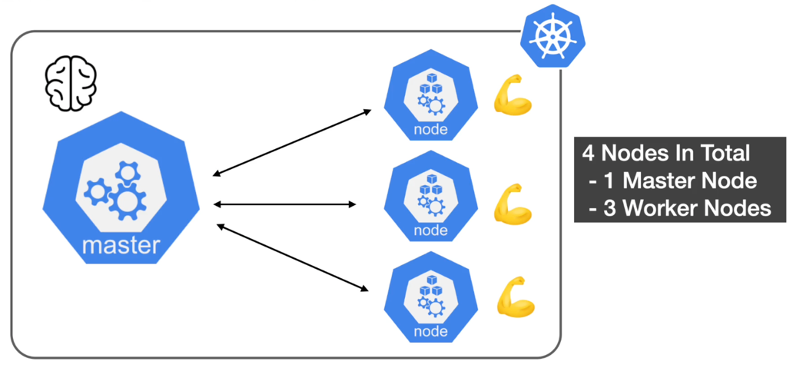

- In Kubernetes Cluster, there is a difference between the Master Node and the Worker Node.
  - **Master Node:**
    - Brains of the cluster.
    - Place where all the control and decisions are made.
    - Master Node runs all cluster's control plane services.
  - **Worker Node:**
    - Place where all the heavy lifting stuff happens, such as running the applications.
- Both the Master Node and Worker Node communicate with each other through something called a **kubelet**.
- Within a cluster, there is usually more than one worker node.

## 1.2. Master Node and Control Plane

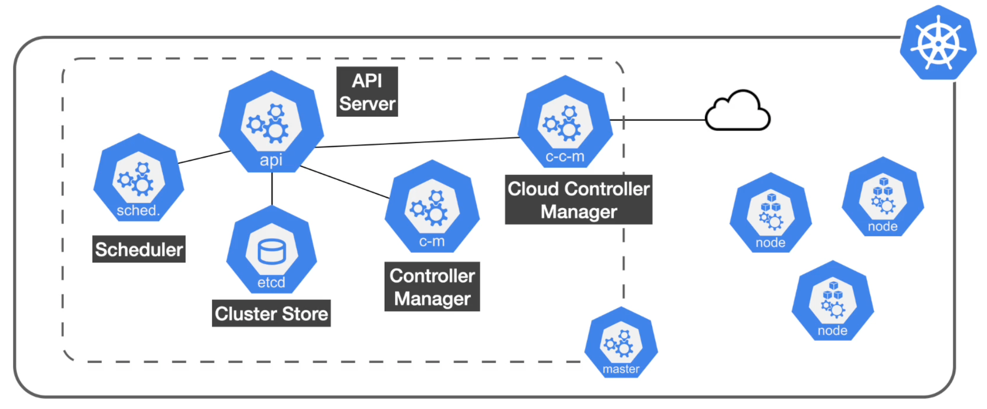

- Master Node contains something called a Control Plane.
- The Control Plane is made of several components:
  - API Server
  - Scheduler
  - Cluster Store
  - Controller Manager
  - Cloud Controller Manager (talks to underlying cloud provider API such as AWS, Google Cloud, Azure etc)
- All of these components within the Master Node communicate via the API Server.
- Worker Nodes are outside the bounds of the Control Plane.

### 1.2.1. API Server

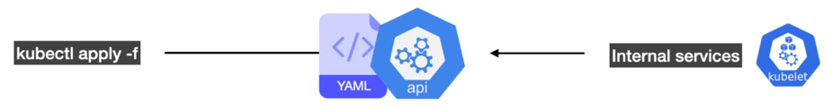

- API Server is the Frontend to the Kubernetes Control Plane.
- All (both External and Internal) communications go through API server.
- Exposes RESTful API on port 443.
- In order for it to talk to the API, authentication and authorization checks are performed.

### 1.2.2. Cluster Store (state etcd)

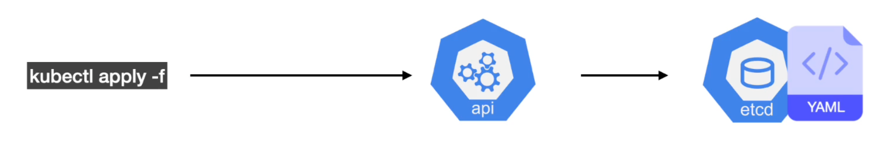

- Contains all of the state for our application.
- Stores configuration and state of the entire cluster.
- Kubernetes currently uses **etcd** which is a Distributed Key Value data store.
- In essence, **etcd** is a single-source-of-truth (like a database).

### 1.2.3. Scheduler

- Watches for new workloads/pods and assigns them to a node based on several scheduling factors.
- Is the node healthy?
- Does it have enough resources?
- Is the port available?
- Affinity and anti-affinity rules.
- Other important factors.

### 1.2.4. Controller Manager


- Daemon that manages the control loop.
- Basically it's a controller of controllers.
- In Kubernetes there are a bunch of controllers, such as Node Controller.
- Each Controller Manager watches the API Server for changes, with goal to watch for any changes that do not match our desired state.

#### 1.2.4.1. Node Controller

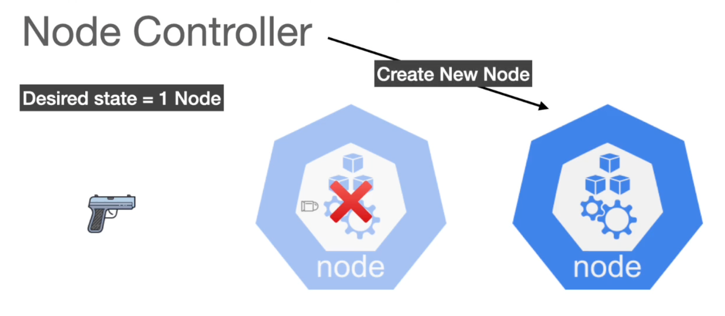
  
- Whenever the current state doesn't match the desired state, Node Controller then reacts to those changes.
- For example, if a node dies for whatever reason, the Node Controller is responsible for bringing another node.

#### 1.2.4.2. ReplicaSet Controller

- Responsible for ensuring that we have the correct number of pods running.

#### 1.2.4.3. Endpoint Controller

- This controller assigns ports to services.

#### 1.2.4.4. Namespace Controller

- Provides a mechanism for isolating groups of resources within a single cluster.

#### 1.2.4.5. Service Accounts Controller

- Provides an identity for processes that run in a Pod.

### 1.2.5. Cloud Controller Manager


- Responsible for interacting with the underlying cloud provider (such as AWS, Azure, Google Cloud).

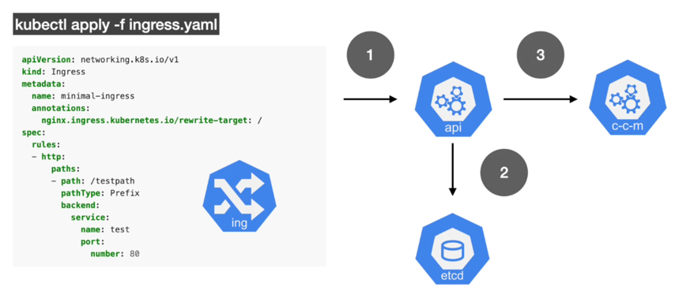

- The configuration shown above, `ingress.yml` file, contains an Ingress and this gives us a Load Balancer.
1. First, this request goes through the **API Server**. 
2. That request gets stored in **etcd**.
3. And then **Cloud Controller Manager** kicks in.

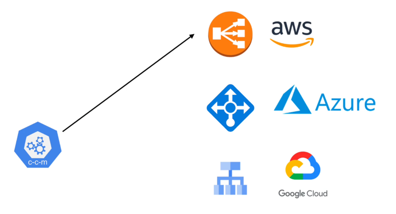

- Depending on where the Kubernetes is run, lets say AWS for example, then it creates a Load Balancer on AWS.
- Just how it takes care of Load Balancers, it does the same for Storage and Instances.

## 1.3. Worker Node

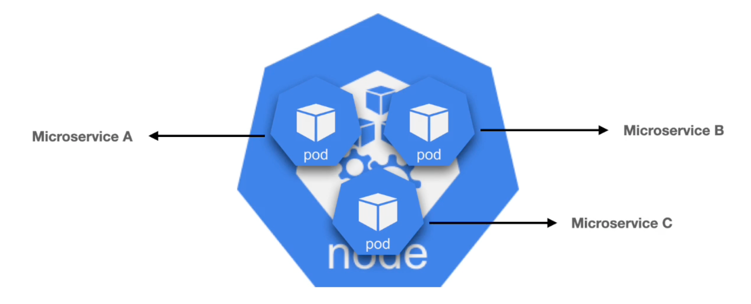

- It is a VM or physical machine running on Linux.
- Provides running environment for your applications.
- Inside a Worker Node, there are Pods.
- Pod is a container in the Docker world.
- When deploying applications, we should really be deploying Microservices.

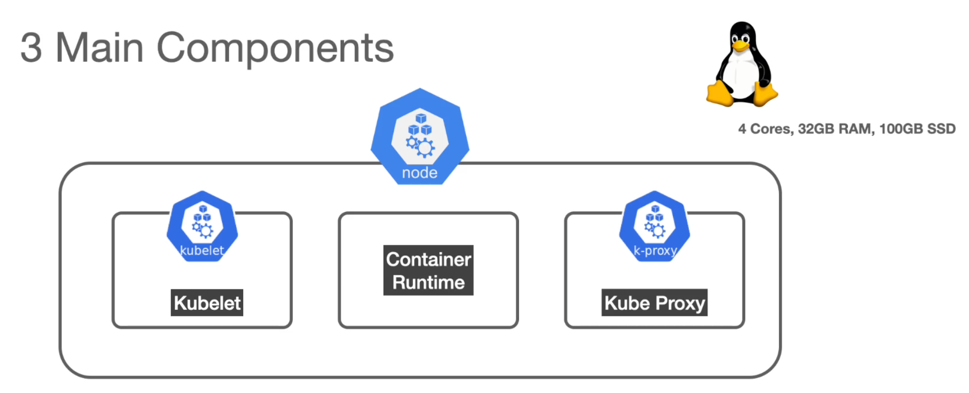

- The Worker Node has 3 main components:
  - Kubelet (agent)
  - Container Runtime
  - Kube Proxy

### 1.3.1. Kubelet

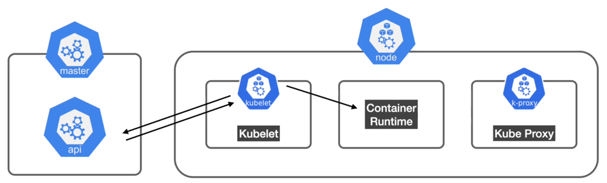

- This is the Main Agent that runs on every single node.
- Receives Pod definitions from API Server.
- Interacts with Container Runtime to run containers associated with that Pod.
- Reports Node and Pod state to Master Node through the API Server.

### 1.3.2. Container Runtime

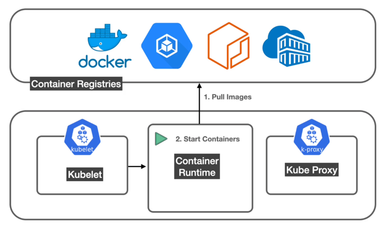

- Responsible for pulling images from container registries such as:
  - **Docker Hub**
  - **GCR** (Google Container Registry)
  - **ECR** (Amazon Elastic Container Registry)
  - **ACR** (Azure Container Registry)
- After pulling the images, it's also responsible for starting containers from those images and also stopping containers.
- Abstracts container management for Kubernetes.
- Within it, we have a Container Runtime Interface (CRI).
  - This is an interface for 3rd party container runtimes.

### 1.3.3. Kube Proxy

- Agent that runs on every node through a DaemonSet.
- Responsible for:
  - Local cluster networking.
  - Each node gets its own unique IP address.
  - Routing network traffic to load balanced services.
- For example
  1. If two Pods want to talk to each other, Kube Proxy will handle that.
  2. If you as a client want to send a request to your cluster, Kube Proxy will handle all of that.

## 1.4. Running Kubernetes Clusters

There are a couple of ways to run Kubernetes Clusters.

### 1.4.1. Running Kubernetes

There are two ways to start Kubernetes:
1. Run it yourself – which is super difficult.
2. Managed (Kubernetes) solution – this is what most companies use.
   - **EKS** – Amazon Elastic Kubernetes Service
   - **GKE** – Google Kubernetes Engine
   - **AKS** – Azure Kubernetes Service
   - Other cloud providers

### 1.4.2. Managed Kubernetes

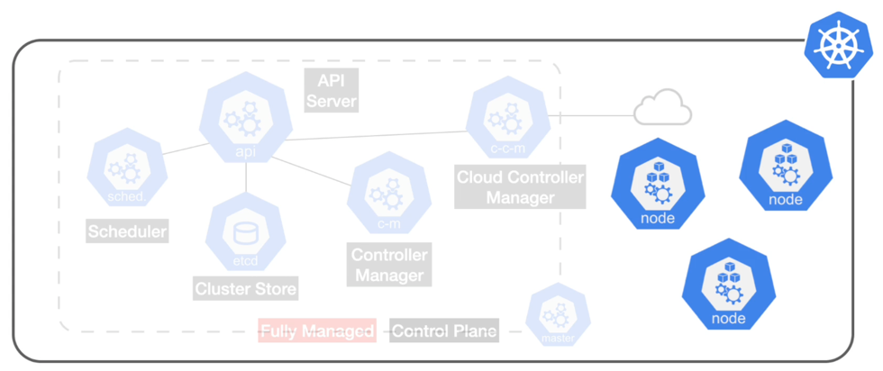

- What does it mean to be "managed"? It means you don't have to worry about Master Node as well as all the services that are run within the Master Node, such as the Scheduler, API Server, Cluster Store, Controller Manager etc.
- All we then need to focus on are the Worker Nodes, which is where all the applications are run.

### 1.4.3. EKS

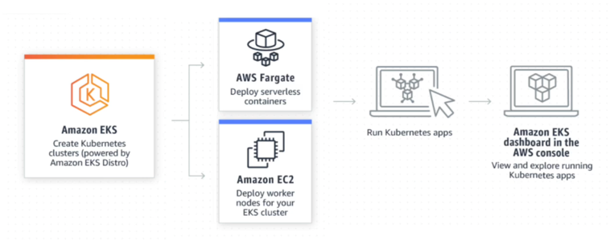

- Managed solution from AWS.
- They give you a cluster, and then you decide how you want to run your applications.
- Currently, there are 2 ways:
  - **AWS Fargate**
    - Mainly for serverless containers (applications that don't need to be running all the time).
  - **Amazon EC2**
    - This is the place where you deploy your Worker Nodes for your EKS cluster.
    - Used for long-running applications.

### 1.4.4. Running Kube Cluster Locally

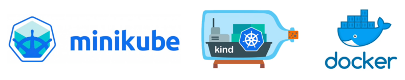

- You shouldn't be using Managed Services via Cloud Providers because it's expensive – use it only for production.
- For development use a local cluster.
- To create a local cluster, there are 3 main solutions:
  - Minikube
  - Kind
  - Docker
- These solutions are for learning Kubernetes.
- Used for Local Development or CI.
- **Important note:** DO NOT USE IT IN ANY ENVIRONMENT INCLUDING PRODUCTION.

### 1.4.5. Minikube

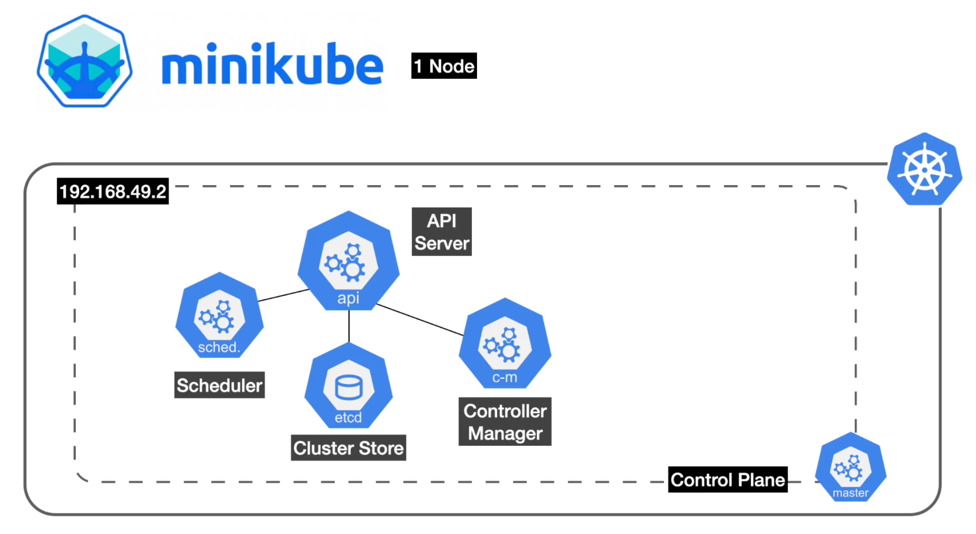

- Has great community.
- Add-ons and lots of features.
- Great documentation.
- Installation: Docker + Minikube.
- The goal is for our machine to interact with our cluster.
  - The way to do this is to use a command line application called `kubectl`.

## 1.5. Installing Docker

The goal is to install Minikube. But prerequisite to that is to have Docker installed.

1. To install Docker navigate to https://www.docker.com/
2. Create a Docker Hub account and make sure you can create repositories here https://hub.docker.com/
3. Test Docker version with command:
```bash
docker --version
```
4. Pull a starter Docker image:
```bash
docker run -d -p 80:80 docker/getting-started
```
5. Test if the container is pulled:
```bash
docker ps
```
6. To see what was pulled navigate to:
```bash
http://localhost
```
7. To stop a container:
```bash
docker stop <container-id>
```
8. To remove a container which was stopped:
```bash
docker rm <container-id>
```

## 1.6. Installing Minikube

Once you have Docker installed, it's time to install Minikube.

1. To install Minikube navigate to https://minikube.sigs.k8s.io/docs/
2. Open **Get Started** tab https://minikube.sigs.k8s.io/docs/start/
3. To get Minikube installed on a Mac use command:
```bash
brew install minikube
```
4. Test Minikube version with command:
```bash
minikube version
```
5. Start a Minikube cluster with command:
```bash
minikube start
```
6. Check Minikube status with command:
```bash
minikube status
```
7. Now you should successfully have a Kubernetes Cluster running on your local machine.

## 1.7. Installing KUBECTL

- What we want to do is to interact from our machine with the cluster.
- A way to do it is by using a command line application called `kubectl`.
- `kubectl` is a Kubernetes command line tool.
- Run commands against your cluster.
  - Deploy
  - Inspect
  - Edit resources
  - Debug
  - View logs
  - Etc

1. To install `kubectl` navigate to https://kubernetes.io/docs/tasks/tools/
2. For Mac go to https://kubernetes.io/docs/tasks/tools/install-kubectl-macos/
3. Follow the docs. But in short, to install it use this command:
```bash
curl -LO "https://dl.k8s.io/release/$(curl -L -s https://dl.k8s.io/release/stable.txt)/bin/darwin/amd64/kubectl"
```
4. Make the `kubectl` binary executable:
```bash
chmod +x ./kubectl
```
5. Move the `kubectl` binary to a file location on your system PATH:
```bash
sudo mv ./kubectl /usr/local/bin/kubectl
```
6. Chown it to root privileges:
```bash
sudo chown root: /usr/local/bin/kubectl
```
7. Test the details and version:
```bash
kubectl version --output=yaml
```

## 1.8. Kubernetes Hello World

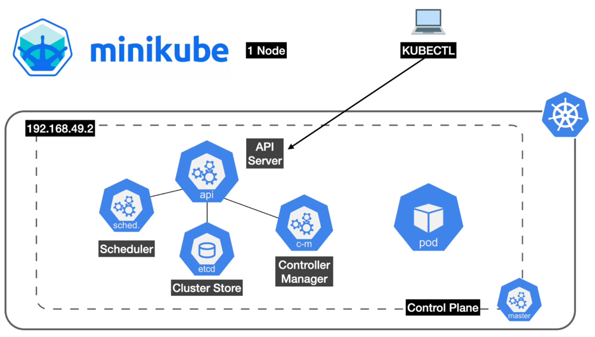

- What we want to do is execute a `kubectl` command against our API Server, and let the Scheduler and API Server do its thing.
- Doing this will automatically create a Pod for us.
- A Pod is a collection of 1 or more containers.

1. First make sure the Docker is up and running:
```bash
docker run --rm -p 80:80 peopleoid/kubernetes:hello-world
```
2. This is currently running on Docker. To confirm this works navigate to:
```bash
http://localhost:8080/
```
3. To run it via Kubernetes:
```bash
kubectl run hello-world --image=peopleoid/kubernetes:hello-world --port=80
```
4. A new Pod was just created. To verify this use command:
```bash
kubectl get pods
```
5. To access this pod:
```bash
kubectl port-forward pod/hello-world pod/hello-world 8080:80
```
6. Now the application is deployed using Kubernetes. To confirm this works navigate to:
```bash
http://localhost:8080/
```
7. To delete a Pod:
```bash
kubectl delete pods hello-world
```

# 2. Exploring K8S Cluster

Let's explore the components that make up the Control Plane, how you can view the Nodes etc.

## 2.1. Exploring Cluster

Currently, we only have 1 node and that is the Master Node.

1. To see all available nodes use command:
```bash
kubectl get nodes
```
2. At this point there should be no existing pods in the default namespace. To verify this use command:
```bash
kubectl get pods
```
3. To view ALL pods from ALL namespaces use command:
```bash
kubectl get pods -A
```
4. Let's create a new Pod again:
```bash
kubectl run hello-world --image=peopleoid/kubernetes:hello-world --port=80
```
5. Verify the Pod was created:
```bash
kubectl get pods
```
6. View again ALL the pods in ALL namespaces:
```bash
kubectl get pods -A
```

## 2.2. SSH Into Nodes

1. View all nodes:
```bash
kubectl get nodes
```
2. To SSH into the available node, use command:
```bash
minikube ssh
```
3. You can then see the directory you landed in using the command:
```bash
pwd
```
4. Or go to root directory
```bash
cd /
```
5. List everything from root
```bash
ls
```
6. See all binaries:
```bash
ls bin
```
7. Check Docker version which was installed in this node:
```bash
docker --version
```
8. View Docker containers running in this node:
```bash
docker ps
```

## 2.3. Starting and Stopping Clusters

Let's see how we can stop and delete a Kubernetes cluster, as well as creating a cluster with 2 nodes.

1. Make sure the cluster is running:
```bash
minikube status
```
2. To stop a cluster, while keeping all the configuration and settings, use command:
```bash
minikube stop
```
3. Check again to verify the cluster was stopped:
```bash
minikube status
```
4. To start the cluster again, use command:
```bash
minikube start
```
5. Check again if the cluster is successfully running:
```bash
minikube status
```
6. If you want to delete the cluster completely (not only to stop it), use command:
```bash
minikube delete
```

## 2.4. Cluster with 2 Nodes

Let's use a Minikube to start a cluster with 2 nodes.

1. To create a cluster with 2 nodes, use command:
```bash
minikube start --nodes=2
```
2. Now verify if there are 2 clusters using the command:
```bash
minikube status
```
3. Verify there are 2 nodes using the command:
```bash
minikube get nodes
```
4. Check the IP address of the Master Node. If we don't specify which node, it will default to the Master Node:
```bash
minikube ip
```
5. If we want to get the IP of a specific node, use command:
```bash
minikube ip --node=minikube-m02
```

## 2.5. Minikube Logs

Checking logs of nodes can be used to debug them, or just track the node log information.

1. Check logs for the Master Node:
```bash
minikube logs
```
2. Follow the logs in real time as they happen:
```bash
minikube logs -f
```
3. Check all nodes and make sure there is more than one available:
```bash
kubectl get nodes
```
4. Get logs of a specific node:
```bash
minikube logs --node=minikube-m02
```

# 3. Pods

## 3.1. Pods
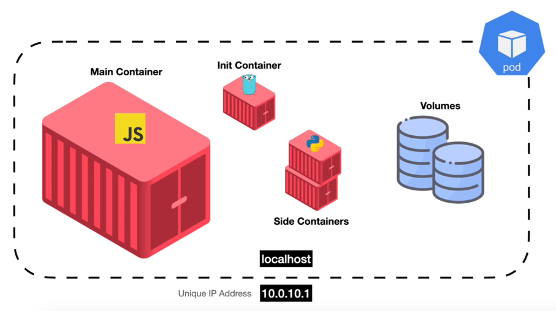

- In Kubernetes, Pod is the smallest deployable unit (not a container).
- Within a Pod, there is always 1 main container.
- The main container represents your application, whether it was written in NodeJS, JavaScript, Golang, etc.
- You may or may not have an **Init Container**, which are executed before the **main container**.
- Next, you may or may not have **Side Containers**.
  - You can have 1 or 2 or however many you want, and also some side language (python, java, etc).
  - Side containers are containers that support your Main Container.
  - For example, you might have a side container that acts as a proxy to your main container.
- Within Pods, you can have **Volumes**, and this is how containers share data between them.
- The way these containers communicate with each other within a Pod, is through localhost and whatever port they expose to.
- Every Pod itself has a unique IP address, which means if another Pod wants to talk to this Pod, it uses the unique IP address.
- So, a Pod is a group of 1 or more containers.
- Represents a running process.
- Shares the same network and volumes.
- Never create Pods on its own – use controllers instead.
- Pods are ephemeral (short-lived) and disposable.

### 3.1.1. Smallest Deployable Unit

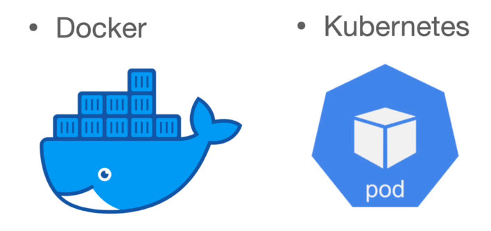

- **For Docker**, smallest deployable unit are Containers.
- **For Kubernetes**, smallest deployable unit are Pods.

## 3.2. Imperative vs Declarative Management

- Pods can be created using an **imperative** command such as:
```bash
kubectl run hello-world --image=peopleoid/kubernetes:hello-world --port=80
```
- The other approach is to use a declarative configuration.
- Declarative configuration defines the exact same command as imperative, but it's using a configuration (usually `.yml`) file such as:
```yml
apiVersion: v1
kind: Pod
metadata:
  name: hello-world
  labels:
    app: hello-world
spec:
  containers:
    - name: hello-world
      image: peopleoid/kubernetes:hello-world
      resources:
        limits:
          memory: "128Mi"
          cpu: "500m"
      ports:
        - containerPort: 80
```

### 3.2.1. Declarative vs Imperative Configuration

- **Imperative:**
  - Should be used mainly for learning purposes.
  - When you want to troubleshoot something.
  - Experimenting with something within the cluster.
- **Declarative:**
  - Reproducible, meaning you can take the same configuration and apply it in multiple different environments, such as:
    - Testing environment
    - Demo environment
    - Production environment
    - Etc
  - Best practices are to use declarative configuration.

## 3.3. Create Pods Imperative Command

Let's explore how to create pods using `kubectl`.

First we'll create a Pod using **imperative** command, and then we'll declare a Pod using **declarative** configuration.

1. Pods are created in the default namespace if not specified otherwise explicitly. Make sure the `hello-world` Pod doesn't exist:
```bash
kubectl get pods
```
2. Now use the **imperative** command to create the Pod:
```bash
kubectl run hello-world --image=peopleoid/kubernetes:hello-world --port=80
```
3. Check again and verify this newly created Pod is running:
```bash
kubectl get pods
```
4. Connect to this Pod using the command:
```bash
kubectl port-forward pod/hello-world 8080:80
```
5. Verify that you can access:
```bash
http://localhost:8080
```

## 3.4. Create Pods Using Declarative Configuration

- Another way we can create Kubernetes objects is using a yaml file.
- Yaml is a serialization language used to format configuration files.

1. Example Pod can be found in this [pod.yml](yamls/pod.yml) file.
2. Check if there is already a `hello-world` Pod:
```bash
kubectl get pods
```
3. If there is a `hello-world` Pod then delete it:
```bash
kubectl delete pods hello-world
```
4. Now create a Pod from **declarative** configuration file:
```bash
kubectl apply -f pods/pod.yml
```
5. Connect to this Pod:
```bash
kubectl port-forward pod/hello-world 8080:80
```
6. Verify that you can access:
```bash
http://localhost:8080
```

## 3.5. Pod YAML Config Overview

Here is an example of a Kubernetes Pod defined in `pod.yml` file:

```yml
apiVersion: v1
# Tells Kubernetes that this is a Pod yml file
kind: Pod
metadata:
  # Name of this Pod
  name: hello-world
  labels:
    # Pod label
    app: hello-world
spec:
  # Pod is a collection of 1 or more containers
  containers:
      # This container is named 'hello-world'
    - name: hello-world
      # Image name
      image: peopleoid/kubernetes:hello-world
      resources:
        # This Pod can only access a certain amount of memory and cpu
        limits:
          memory: "128Mi"
          cpu: "500m"
      ports:
          # This container is listening on port 80
        - containerPort: 80
```

# 4. KUBECTL

Let's learn about the common `kubectl` commands that we're gonna be using within our clusters.

## 4.1. Create and Delete Resources

1. Make sure to delete `hello-world` pod if it's running. To check all pods use command:
```bash
kubectl get pods
```
2. To create a pod based on **declarative** configuration file, use command:
```bash
kubectl apply -f pods/pod.yml
```
3. Another way to create a pod is to take the output (`cat pods/pod.yml`) and feed it into `kubectl apply`:
```bash
cat pods/pod.yml | kubectl apply -f -
```
4. Verify if the pod was created:
```bash
kubectl get pods
```
5. Delete an existing pod:
```bash
kubectl delete pods hello-world
```
6. Verify if the pod was deleted:
```bash
kubectl get pods
```

## 4.2. List resources

1. To list all pods from ALL namespaces:
```bash
kubectl get pods -A
```
2. To list EVERYTHING (not just pods) within the default namespace:
```bash
kubectl get all
```
3. To list EVERYTHING (not just pods) within ALL namespaces:
```bash
kubectl get all -A
```
4. To search pods within a specific namespace:
```bash
kubectl get pods -n kube-system
```
- `-n <namespace>` targets the namespace name.
5. Find all existing namespaces:
```bash
kubectl get namespaces
```

## 4.3. KUBECTL Describe

1. Verify the `hello-world` pod is running:
```bash
kubectl get pods
```
2. To view all details and information about a specific pod use:
```bash
kubectl describe pods hello-world
```
3. Get a little more information about a specific pod:
```bash
kubectl get pods hello-world -o wide
```

## 4.4. Formatting Output

1. Format logs as table:
```bash
kubectl get pods hello-world -o wide
```
2. Format logs as yaml:
```bash
kubectl get pods hello-world -o yaml
```
3. Format logs as JSON:
```bash
kubectl get pods hello-world -o json
```

## 4.5. Logs

Using logs will help to debug pods, applications etc.

1. To print logs of a specific pod:
```bash
kubectl logs hello-world
```
2. Follow logs (if an event happens it will be shown in real time):
```bash
kubectl logs hello-world -f
```
3. If there are multiple containers in a pod, to get logs of a specific container use command: 
```bash
kubectl logs hello-world -c hello-world
```

## 4.6. Shell Access To A Running Pod

Sometimes you may want to jump into container's shell and debug from within.

1. To enter a pod via terminal in interactive mode (`-it` parameter):
```bash
kubectl exec -it hello-world -- bash
```
2. Or if it requires SH:
```bash
kubectl exec -it hello-world -- sh
```
3. Similarly, if there are multiple containers, to enter into a specific one use the command:
```bash
kubectl exec -it hello-world -c hello-world -- sh
```
- Entering into containers like this is usually used for debugging purposes.
4. You can also just execute commands from outside without entering into the container. This is called non-interactive mode. For example:
```bash
kubectl exec hello-world -- ls /
```

## 4.7. Access Pod via Port Forward

Sometimes when you want to debug your application, or just want to verify if things are working, if you want to access the application that runs within your pod, you can do it using `kubectl port-forward`.

1. Connect to a pod:
```bash
kubectl port-forward hello-world 8080:80
```
2. Verify that it works on:
```bash
http://localhost:8080/
```
3. You can change the outer port of the pod, for example:
```bash
kubectl port-forward hello-world 8081:80
```
4. Verify that it works but on port `8081` this time:
```bash
http://localhost:8081/
```
5. The command `kubectl port-forward` works for other resources and not just pods (services and others).
You can also port forward by explicitly stating that it's a pod:
```bash
kubectl port-forward pod/hello-world 8080:80
```

## 4.8. List All Resource Types

1. To view a list of all resources:
```bash
kubectl api-resources
```

## 4.9. KUBECTL Cheatsheet

Full cheatsheet can be found on https://kubernetes.io/docs/reference/kubectl/cheatsheet/

1. See all available commands:
```bash
kubectl --help
```

# 5. Deployments

## 5.1. Don't Use Pods On Its Own

### 5.1.1. The Truth About Pods

- When it comes to pods, you should never deploy pods using `kind:Pod`.
- As an example, the file [pod.yml](yamls/pod.yml) is of `kind: Pod`.
- Don't treat pods like pets, because they are ephemeral (lives for a very short period of time).
- Pods on its own don't self-heal. For example if you delete a single pod:
```bash
kubectl delete pods hello-world
```
- We just killed the last pod, and it doesn't self-heal. This is dangerous because if you have a real application, you always want at least one more pod replica running.
- This is why deploying pods on its own like this doesn't give us enough flexibility.

## 5.2. Deployments Overview

### 5.2.1. Deployments

- We should never use pods on its own.
- Instead, we should manage pods through **deployments**.
- Deployments is a Kubernetes resource which manages releases of new applications.
- It provides zero downtime deployments.
- Behind the scenes, it creates a replica set.

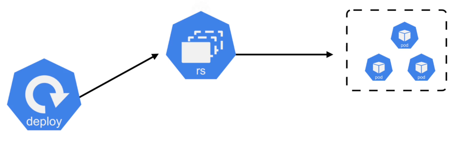

- The way it works is:
  1. You have a deployment.
  2. The deployment creates a ReplicaSet.
  3. ReplicaSet ensures the desired number of pods are always running.
  4. In this case lets say we want to have 3 pods, so ReplicaSet will ensure we have 3 pods at all times.

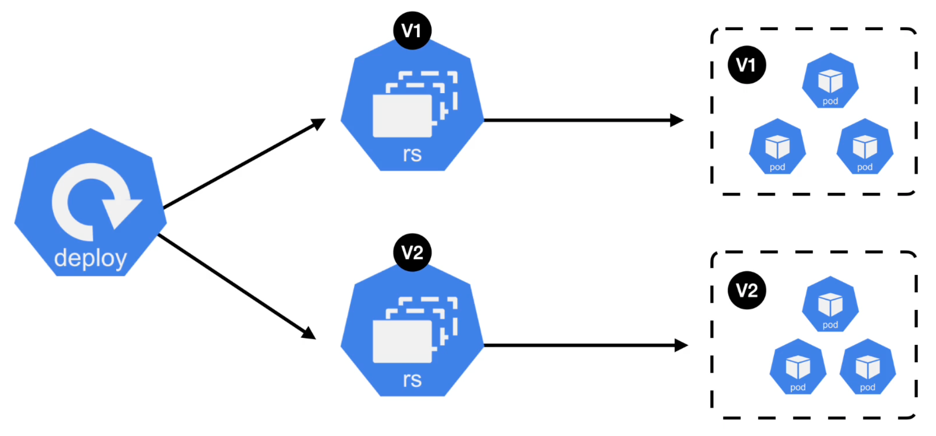

- The purpose of deployments is to facilitate software deployments. For example:
  1. Let's say in this scenario we currently have version 1 of the application.
  2. If we want to release a new version, Kubernetes will take care of the deployment for you.
  3. It will give you another version of the ReplicaSet (v2 for example), which will run alongside v1.
  4. Once everything looks good on v2, you will have no traffic going to v1 of your application.

## 5.3. Creating Deployment

1. We'll use the file [deployment.yml](yamls/deployment.yml) to deploy the pod we currently have.
2. To deploy it use the command:
```bash
kubectl apply -f pods/deployment.yml
```
3. View the deployed pod and verify that it's running:
```bash
kubectl get pods
```

## 5.4. Managing Deployments

1. To view all deployments:
```bash
kubectl get deployments
```
2. To view all details and information regarding specific deployment:
```bash
kubectl describe deployment hello-world
```
3. To delete a specific deployment:
```bash
kubectl delete deployment hello-world
```
4. Alternatively, you can also target the `.yml` file and delete the deployment that way:
```bash
kubectl delete -f pods/deployment.yml
```

## 5.5. Replica Sets Overview

### 5.5.1. ReplicaSet

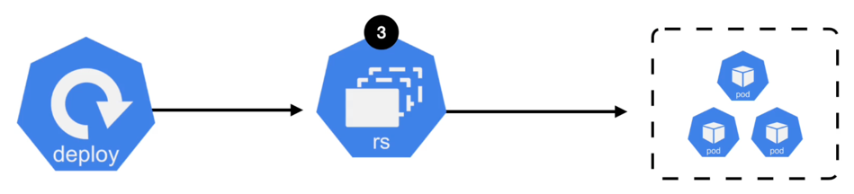

- When you create a deployment, it gives us something called a ReplicaSet.
- ReplicaSet is a resource in Kubernetes, which ensures the desired number of pods are always running.
- It is recommended to have at least 3 replicas of the same version.

### 5.5.2. Control Loops

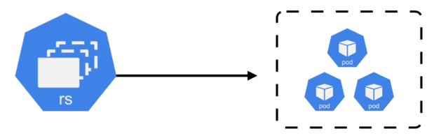

- The way Replica Sets manage to do this is using something called Control Loops.
- ReplicaSets implement a background control loop that checks the desired number of pods are always present on the cluster.

## 5.6. Listing Replica Sets

- Never create a ReplicaSet on its own, because when you create a deployment, it will create a ReplicaSet for us – always use deployments!
- Make sure not to delete ReplicaSet, because it's managed by the deployment.
- If you want to delete a ReplicaSet, delete the whole deployment.

1. View all created ReplicaSets:
```bash
kubectl get replicaset
```
2. To view details and information about ReplicaSets:
```bash
kubectl describe replicaset
```
or
```bash
kubectl describe rs
```
3. To view details and information about a specific ReplicaSet:
```bash
kubectl describe rs hello-world-5d9b5cdd77
```

## 5.7. Port Forward Deployments

- **Important:** using port forwarding like this is meant to be used for debugging purposes.
- In reality services should be used instead of port-forwarding.

1. Check if `hello-world` pod is running:
```bash
kubectl get pods
```
2. Verify that a single deployment is running a pod:
```bash
kubectl get deployment
```
3. Now let's connect to this deployment:
```bash
kubectl port-forward deployment/hello-world 8080:80
```
4. Verify that it works:
```bash
http://localhost:8080/
```

## 5.8. Scaling Deployment Replicas

1. In [deployment.yml](yamls/deployment.yml), update config so that `replicas: 3`.
2. Apply those changes:
```bash
kubectl apply -f pods/deployment.yml
```
3. Check how many pods are running (should be 3 now):
```bash
kubectl get pods
```
4. Verify if there are 3 ReplicaSets:
```bash
kubectl get rs
```
5. Verify the deployment is running 3 pods:
```bash
kubectl get deployment
```

# 6. Deployment And Rolling Updates

- To recap: when we have deployment, we have ReplicaSet, and then within ReplicaSet we specify the number of replicas that we want.
- So far, we scaled our deployment to 3 pods.

## 6.1. Rolling Updates

### 6.1.1. Deployments

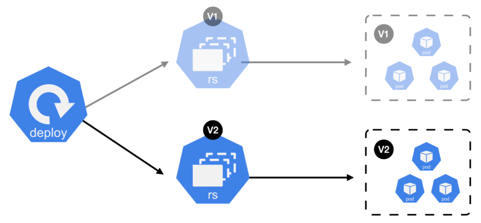

- Rolling update simply means you have a new version of the application.
- For example, if we have a new version of the application (lets say v2), then we want Kubernetes to take care of the rolling update for us.
- Let's say we have 2 Replica Sets, and in Kubernetes once v2 is up and running or fine, it simply scales down v1 and no traffic is sent.

## 6.2. Rolling Updates In Action

1. View all pods and make sure there are 3 replica pods running:
```bash
kubectl get pods
```
2. Port forward this deployment:
```bash
kubectl port-forward deployment/hello-world 8080:80
```
3. Now we'll make v2 of this exact same application.
The only thing we really have to change is the image name,
because image name uniquely identifies every version of the application:
```yml
image: peopleoid/kubernetes:hello-world-v2
```
Also add this under `labels: app: hello-world` key:
```yml
annotations:
  kubernetes.io/change-cause: "peopleoid/kubernetes:hello-world-v2"
```
4. Now redeploy:
```bash
kubectl apply -f pods/deployment.yml
```
5. Connect again:
```bash
kubectl port-forward deployment/hello-world 8080:80
```
6. Verify if this time the web page was changed into v2:
```bash
http://localhost:8080/
```

## 6.3. Rollbacks

- When we deploy a new version (v2 for example), Kubernetes is not actually deleting the old version (v1 for example) ReplicaSet.
- The reason it works like this is so it can perform rollbacks in case we need it.

1. To see this, view all ReplicaSets:
```bash
kubectl get rs
```
2. View history of rollbacks:
```bash
kubectl rollout history deployment hello-world
```
3. To roll back to a specific deployment, use command:
```bash
kubectl rollout undo deployment hello-world
```
4. Verify if these changes took effect. The highest number under `REVISION` column is our currently active deployment:
```bash
kubectl rollout history deployment hello-world
```
5. Verify on localhost if the older version is now showing:
```bash
http://localhost:8080/
```
6. To review history of deployment for a specific revision:
```bash
kubectl rollout history deployment hello-world --revision=4
```

## 6.4. Manage Your Cluster Using Declarative Approach

- Ever since we rolled back to v1, you can notice how in our [deployment.yml](yamls/deployment.yml) it still says we have deployed `hello-world-v2`, so this might get confusing.
- Updates should be done using **declarative** approach and not **imperative**.
  - That's because usually as you work in a team of engineers, they can see all the changes you've done through git version control system.
  - But using **imperative** commands can't be tracked through git.

1. Modify [deployment.yml](yamls/deployment.yml) file so that it uses `hello-world-v3`:
```yml
...
annotations:
  kubernetes.io/change-cause: "peopleoid/kubernetes:hello-world-v3"
...
image: peopleoid/kubernetes:hello-world-v3
...
```
2. Apply these changes:
```bash
kubectl apply -f pods/deployment.yml
```
3. Connect again:
```bash
kubectl port-forward deployment/hello-world 8080:80
```
4. Verify if this time the web page was changed into v3:
```bash
http://localhost:8080/
```
5. Check one more time if v3 is the latest revision active:
```bash
kubectl rollout history deployment hello-world
```

## 6.5. Revision History Limit

- To view more revisions, increase revision history limit in [deployment.yml](yamls/deployment.yml) file:
```yml
revisionHistoryLimit: 20
```
- By default, it's set to 10.

## 6.6. Configure Deployment Rolling Strategy

### 6.6.1. Deployment Strategy

- In Kubernetes, when it comes to deploy a new version of our application, within the deployment itself we can use 2 strategies:
  - **Recreate** strategy
    - Deletes every single pod that is running before it recreates a new version of your application.
    - This is very dangerous because if you have users using your application, you will have downtime.
  - **Rolling Update** strategy
    - This is the preferred and default strategy set by Kubernetes.
    - Makes sure the application keeps on receiving traffic from previous version, while the new version is up and running.
    - Alternates the traffic to the new version when the new version is healthy.

1. In [deployment.yml](yamls/deployment.yml) add this below `spec` key:
```yml
strategy:
  type: RollingUpdate
  rollingUpdate:
    maxUnavailable: 1
    maxSurge: 1
```
2. Increase the number of replicas to 5:
```yml
replicas: 5
```
3. Update application version to v4:
```yml
...
annotations:
  kubernetes.io/change-cause: "peopleoid/kubernetes:hello-world-v4"
...
image: peopleoid/kubernetes:hello-world-v4
...
```
4. Apply these changes:
```bash
kubectl apply -f pods/deployment.yml
```
5. Verify if these changes have rolled out:
```bash
kubectl rollout status deployment hello-world
```
6. Verify if there are 5 pods now:
```bash
kubectl get pods
```
7. Connect to this Pod using the command:
```bash
kubectl port-forward deployment/hello-world 8080:80
```
8. Verify if the v4 is running on localhost:
```bash
http://localhost:8080/
```

## 6.7. Pausing And Resuming Rollouts

- Let's say that we are in the middle of a rollout, but now let's say we spotted a bug, so we want to pause that rollout.

1. To pause a rollout use command:
```bash
kubectl rollout pause deployments hello-world 
```
2. After fixing the bug, to resume that rollout use command:
```bash
kubectl rollout resume deployments hello-world 
```

# 7. Services

- So far we connected to the application using **imperative** `kubectl port-forward` command.

## 7.1. Kubernetes Service

### 7.1.1. Services

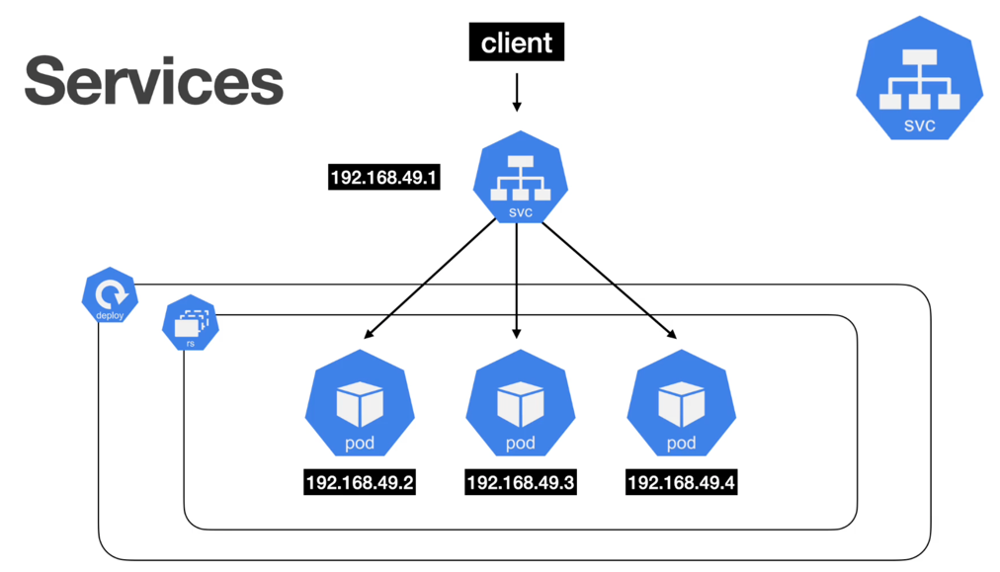

- Using port-forwarding should be used only for testing purposes.
- Instead of accessing/connecting to the app using port-forward, we should be using **services**.
- To recap, we have a **Deployment**, which has a **ReplicaSet**, which manages individual **Pods**, and each pod has its own unique IP address.
- Now let's say we have a client who wants to access the application.
- We can't use the pod IP address because pods are short-lived, they are not reliable.
  - Instead of that approach, we need to use services.
  - If we scale up or down, pods get a new IP address.
  - Never rely on pod IP address.
- Service IP address is reliable and stable because it never changes.
- Service comes with a stable DNS name and a stable Port.
- Clients should be talking to services if they want to use our application, instead of using port-forwarding.

### 7.1.2. Types Of Services

- ClusterIP (default)
- NodePort
- ExternalName
- LoadBalancer

## 7.2. Customer Microservice Deployment

1. First, deploy two microservices using Docker by running the automated bash script:
```bash
microservices/deploy.sh
```
2. In [yamls](yamls) directory create a new [customer-deployment.yml](yamls/customer-deployment.yml) file. This customer microservice will be running on port 8080 and will have 2 replicas.
3. Let's also scale down [deployment.yml](yamls/deployment.yml) from 5 to 2 replicas.
4. Now apply these changes:
```bash
kubectl apply -f yamls/deployment.yml
```
5. Verify there are 2 `hello-world` pods running:
```bash
kubectl get pods
```
6. Now apply changes for customer microservice:
```bash
kubectl apply -f yamls/customer-deployment.yml
```
7. View pods again and make sure there are 2 pods of customer microservice:
```bash
kubectl get pods
```
8. View logs of an individual customer microservice just to see that it's running on the correct port:
```bash
kubectl logs customer-6cb7ff79b6-2ccmv
```
9. View all the pods, services, deployments and replicas:
```bash
kubectl get all
```
10. View all deployments running right now:
```bash
kubectl get deployments
```
11. Port forward the customer microservice:
```bash
kubectl port-forward deployment/customer 8080:8080
```
12. Confirm that you can access the GET API route from customer microservice:
```bash
http://localhost:8080/api/v1/customers
```

## 7.3. Exercise

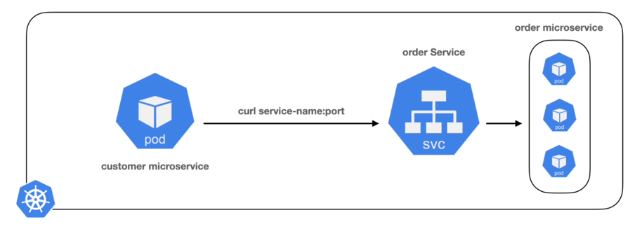

To do:

1. Create a deployment yaml for the **order microservice** so that we can have these two microservices talk to each other using **Kubernetes Services**.

## 7.4. Exercise Solution

1. Create [order-deployment.yml](yamls/order-deployment.yml) file as a Kubernetes deployment.
2. Apply those changes:
```bash
kubectl apply -f yamls/order-deployment.yml
```
3. Confirm that you have 2 replica pods of order microservice:
```bash
kubectl get pods
```
4. Connect with port forward:
```bash
kubectl port-forward deployment/order 8080:8081
```
5. Check the URL (it should return an empty list because currently `order` microservice is not talking to the `customer` microservice):
```bash
http://localhost:8080/api/v1/orders/customers/1
```

## 7.5. Microservice Communication Using Pod IP Address

- In this example we'll use a direct pod IP address to communicate amongst microservices.
- This is a BAD approach and in real development should not be done this way.

1. Show all pods:
```bash
kubectl get pods
```
2. View details of a specific pod, lets say an order microservice:
```bash
kubectl describe pods order-778c484f7c-46h2w
```
3. Grab its IP address and add it to [customer-deployment.yml](yamls/customer-deployment.yml) file for the container `customer`:
```yml
env:
  - name: ORDER_SERVICE
    value: "10.244.0.39:8081"
```
4. Apply these changes:
```bash
kubectl apply -f yamls/customer-deployment.yml
```
5. Port forward the customer microservice:
```bash
kubectl port-forward deployment/customer 8080:8080
```
6. Check if it works:
```bash
http://localhost:8080/api/v1/customers/1/orders
```
7. Here's the problem with this approach. Let's delete the order microservice:
```bash
kubectl delete -f yamls/order-deployment.yml
```
8. Now let's create the order microservice again:
```bash
kubectl apply -f yamls/order-deployment.yml
```
9. Try to access the same localhost url. It should not work anymore because there's a new pod IP address assigned to the order microservice:
```bash
http://localhost:8080/api/v1/customers/1/orders
```

## 7.6. ClusterIP Service

### 7.6.1. ClusterIP

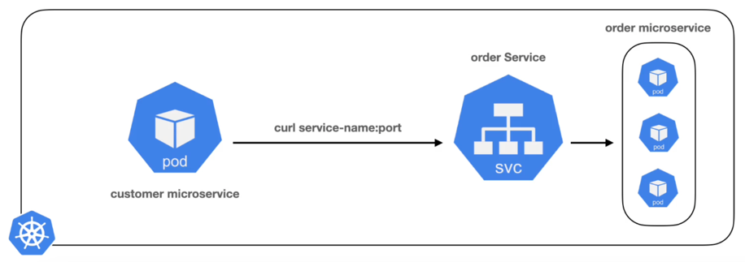

- Default Kubernetes service.
- When you create a service, and you don't specify the type, the default is ClusterIP.
- ClusterIP type is used only for internal access – no external.
- Let's say there's a scenario within a cluster, you have a pod, and let's say in this case we want customer microservice to talk to order microservice.
  - If the customer microservice wants to talk to order microservice internally, we use ClusterIP type service.
  - This service will send traffic to any pod which is healthy.
- Services will only send traffic to healthy pods.
- Customer microservice can then perform a request to the service, and not the pod IP address.

1. To create a service in the same `.yml` file, just add 3 dashes and add this is [order-deployment.yml](yamls/order-deployment.yml) file:
```yml
---
apiVersion: v1
kind: Service
metadata:
  name: order
spec:
  # This will tell the service to send traffic to any pod that
  # has a specific set of labels with app name `order`.
  selector:
    app: order
  ports:
    - port: 8081
      targetPort: 8081
  # This can be omitted, because it's set by default.
  # ClusterIP is used only for internal communication.
  type: ClusterIP
```
2. Apply these changes:
```bash
kubectl apply -f yamls/order-deployment.yml
```

## 7.7. Inspecting ClusterIP Service And Endpoints With KUBECTL

- The goal is to get customer microservice to talk to order microservice.
- But first we have to set the customer microservice to point to the service we created, instead using individual pod IP addresses.

1. View all available services (should be `kubernetes` and `order`):
```bash
kubectl get services
```
2. Get details and information about `order` microservice:
```bash
kubectl describe service order
```
- The `Endpoints` describe IP + Port of healthy pods.
3. To verify if this is true, get all pods:
```bash
kubectl get pods
```
4. Grab and describe a specific `order` pod. Verify if its IP + Port matches one of the service `Endpoints` IP + Ports:
```bash
kubectl describe pods order-778c484f7c-qg6c6
```
5. Update [order-deployment.yml](yamls/order-deployment.yml) file so that it has 3 replicas instead of 2.
6. Apply those changes:
```bash
kubectl apply -f yamls/order-deployment.yml
```
7. Describe `order` microservice once again to verify the `Endpoints` now has 3 IP addresses (3 pods):
```bash
kubectl describe service order
```
8. Update [order-deployment.yml](yamls/order-deployment.yml) back to 2 replicas.
9. You can also directly view all the available endpoints:
```bash
kubectl get endpoints
```

## 7.8. ClusterIP Service In Action

1. Describe the `order` microservice:
```bash
kubectl describe service order
```
2. Take the IP address and plug it in [customer-deployment.yml](yamls/customer-deployment.yml) file:
```yml
env:
  - name: ORDER_SERVICE
    value: "10.109.216.231:8081"
```
3. Apply these changes:
```bash
kubectl apply -f yamls/customer-deployment.yml
```
4. View all services:
```bash
kubectl get services
```
- There should be `kubernetes` and `order` services, both having only ClusterIP and none for ExternalIP.
5. To check which services can be deployed, run command:
```bash
kubectl get deploy
```
6. Now port-forward the customer microservice:
```bash
kubectl port-forward deployment/customer 8080:8080
```
7. Test on localhost. Before we had a connection timeout, but now we're using the service:
```bash
http://localhost:8080/api/v1/customers/1/orders
```
- This should return 1 record.
```bash
http://localhost:8080/api/v1/customers/3/orders
```
- This should return an empty list because there are no orders with ID=3.
8. In [customer-deployment.yml](yamls/customer-deployment.yml), replace the service IP address with just `order`. Kubernetes is smart enough to find the IP address for this service:
```yml
env:
  - name: ORDER_SERVICE
    value: "order:8081"
```
9. Apply these changes:
```bash
kubectl apply -f yamls/customer-deployment.yml
```
10. Port-forward the customer microservice once again:
```bash
kubectl port-forward deployment/customer 8080:8080
```
11. Test on localhost and make sure everything still works like before:
```bash
http://localhost:8080/api/v1/customers/1/orders
```
12. To eliminate the port as well, just set to `"order"` in [customer-deployment.yml](yamls/customer-deployment.yml) file:
```yml
env:
  - name: ORDER_SERVICE
    value: "order"
```
13. Then in [order-deployment.yml](yamls/order-deployment.yml), set port to `80`:
```yml
ports:
  - port: 80
    targetPort: 8081
```
14. Apply these changes for customer:
```bash
kubectl apply -f yamls/customer-deployment.yml
```
15. Now apply changes for order:
```bash
kubectl apply -f yamls/order-deployment.yml
```
16. Port-forward customer again:
```bash
kubectl port-forward deployment/customer 8080:8080
```
17. Test on localhost and make sure everything still works like before:
```bash
http://localhost:8080/api/v1/customers/1/orders
```

## 7.9. NodePort Service

### 7.9.1. NodePort

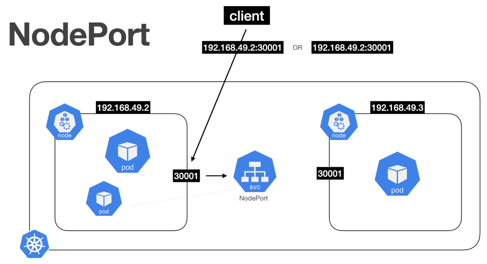

- This type of service allows you to open a port on all nodes.
- Port range: `30000` – `32767`.
- NodePort works like this:
  - Within our cluster, we currently have 2 nodes.
  - Allows us to expose a port between the said range on all nodes.
  - So if we have 2 nodes, lets say we set a port of `30001` on both nodes.
  - Now if we have a client that wants to communicate with our application, the client sends a request directly to that node IP address and port.
  - The client can choose if he wants to hit the first or second node (doesn't matter).
    - Let's say the client hits the first node, the request goes through the first node.
    - When the request reaches that port, the service handles that request and then sends it to particular pod.
    - 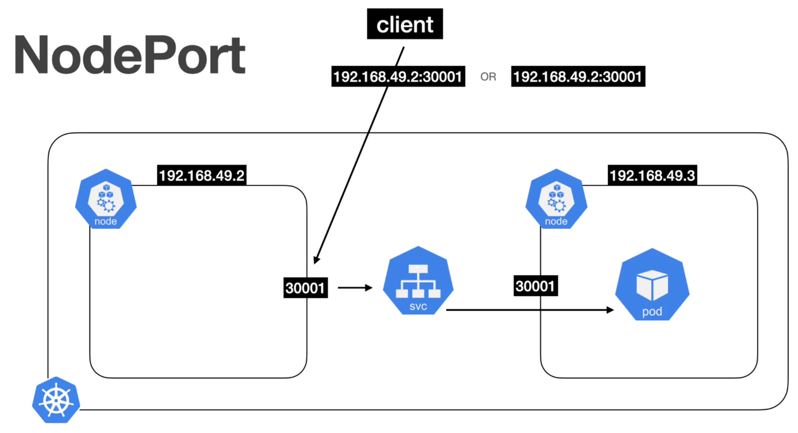
    - Now lets say in the first node, there are no pods, but the client still chooses to send a request to that specific node.
    - What happens is, this request still goes to the service, but the service is responsible for sending the traffic to the appropriate pod.

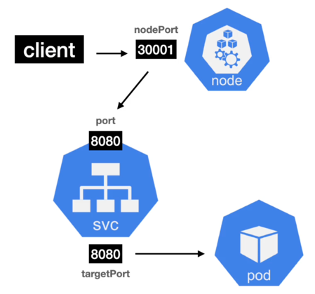
- In regard to `.yml` configuration, `nodePort` property needs to be specified with a port value.
  - If `nodePort` isn't specified, a random port between `30000` – `32767` is chosen.

### 7.9.2. Disadvantages Of NodePort

- There can only be 1 service per port.
- If Node IP address changes, then we have a problem.

## 7.10. Creating NodePort Service

1. In [customer-deployment.yml](yamls/customer-deployment.yml) add a service:
```yml
---
apiVersion: v1
kind: Service
metadata:
  name: customer-node
spec:
  selector:
    app: customer
  ports:
    - port: 80
      targetPort: 8080
      nodePort: 30000
  type: NodePort
```
2. Apply these changes:
```bash
kubectl apply -f yamls/customer-deployment.yml
```
3. Now check if this service was created:
```bash
kubectl get services
```
4. View `customer-node` service details:
```bash
kubectl describe service customer-node
```

## 7.11. Accessing API With NodePort Service

1. Use the standard Docker command to check processes running:
```bash
docker ps
```
- There should be `minikube` and `minikube-m02` running.
2. The same thing should display when you run:
```bash
kubectl get nodes
```
3. View IP for default (`minikube`) node:
```bash
minikube ip
```
4. View IP for the second (`minikube-m02`) node:
```bash
minikube ip -n minikube-m02
```
5. SSH into default minikube:
```bash
minikube ssh
```
6. Now let's send a request from the default node to the second node as `ssh`:
```bash
curl localhost:30000/api/v1/customers
```
7. Try to curl the same API route but with the other node instead of localhost:
```bash
curl 192.168.49.3:30000/api/v1/customers
```
- If both can curl, it means these nodes can talk to each other.
8. Now ssh into the other node:
```bash
minikube ssh -n minikube-m02
```
9. Try curling the same API route:
```bash
curl localhost:30000/api/v1/customers
```
10. Now curl but targeting the other node:
```bash
curl 192.168.49.2:30000/api/v1/customers
```
11. Again, check all existing services:
```bash
kubectl get services
```
12. To get the service to generate its url, use command:
```bash
minikube service customer-node
```
13. Open the URL it generated and confirm if the API works:
```bash
http://127.0.0.1:60815/api/v1/customers
```
- That's it! This is how to access your application using Node Ports.

## 7.12. NodePort With Random Port

1. First, lets check the IP address of the `customer-node` service:
```bash
kubectl get services
```
- It should say `30000` because that's what we defined in `.yml` file.
2. Now delete the `nodePort` in [customer-deployment.yml](yamls/customer-deployment.yml):
```yml
nodePort: 30000
```
3. Delete the existing service using the command:
```bash
kubectl delete svc customer-node
```
4. Apply these changes:
```bash
kubectl apply -f yamls/customer-deployment.yml
```
5. Check the services again:
```bash
kubectl get services
```
- The port should now be random.
6. Get the 2nd node IP address:
```bash
minikube ip -n minikube-m02
```
7. Ssh into it:
```bash
minikube ssh
```
8. Try to curl but using that random port now:
```bash
curl localhost:31127/api/v1/customers
```
10. Rename it from `customer-node` to `customer`:
```yml
metadata:
  name: customer
```
9. Run the minikube service:
```bash
minikube service customer
```
10. Test the API url that was generated:
```bash
http://127.0.0.1:52960/api/v1/customers
```
11. Set the `nodePort` back to `30000`.

## 7.13. Accessing NodePort Service Using ClusterIP Address

- One last thing that can be done with Node Ports is to access the API internally.

1. List all pods:
```bash
kubectl get pods
```
2. Execute into one of the order microservices as interactive mode:
```bash
kubectl exec -it order-778c484f7c-hkmt7 -- sh
```
3. We need to use the curl command, but it does not exist within this shell script. To add curl, use command:
```bash
apk add curl
```
4. Use the IP address of the `customer` microservice that you can find with command `kubectl get svc`:
```bash
curl http://10.103.211.235/api/v1/customers
```
5. Or, instead of IP address we can also say just `customer`:
```bash
curl http://customer/api/v1/customers
```
6. Go back to [customer-deployment.yml](yamls/customer-deployment.yml) and change the name back to `customer-node`:
```yml
metadata:
  name: customer-node
```
7. Delete the `customer` because the port is already allocated:
```bash
kubectl delete svc customer
```
8. Now apply these changes:
```bash
kubectl apply -f yamls/customer-deployment.yml
```
9. Verify the service is added:
```bash
kubectl get svc
```

## 7.14. LoadBalancer Service

### 7.14.1. LoadBalancer

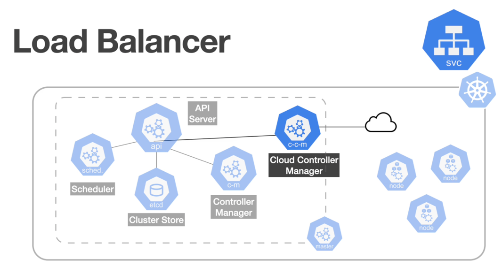

- Standard way of exposing applications to the Internet.
- Creates a load balancer **per service**.
  - This means if you want to expose more than 1 service to the Internet, then you're actually creating a separate load balancer.
- When we create a service of type LoadBalancer, depending on the cloud provider that we're running on (AWS/GCP/Azure), it creates a **Network Load Balancer (NLB)**.

### 7.14.2. What Is A Network Load Balancer?

Documentation:
- AWS: https://docs.aws.amazon.com/elasticloadbalancing/latest/network/introduction.html
- GCP: https://cloud.google.com/load-balancing/docs/network
- Azure: https://learn.microsoft.com/en-us/azure/load-balancer/load-balancer-overview
- Elastic Load Balancing automatically distributes your incoming traffic across multiple targets, such as EC2 instances, containers, IP addresses, in one or more Availability Zones.
- Never let the users talk to VMs directly.
- If you have 10 VMs, it should go through the load balancer which distributes the traffic between those VMs.
- Because we are running Kubernetes locally and not yet running on the cloud, we can run the command `minikube tunnel`.
- In Kubernetes architecture, there is a Cloud Controller Manager, which is responsible for talking to the underlying cloud provider.

## 7.15. Exercise

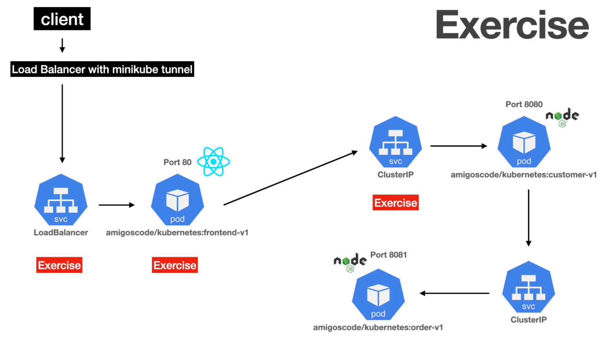

Goal:

1. Have a client hit the load balancer that will run with `minikube tunnel`.
2. Forward that to the LoadBalancer service type.
3. The LoadBalancer service type forwards to pod `peopleoid/kubernetes:frontend-v1`, which listens on port `80`.
4. The frontend gets some data from the customer microservice through a new ClusterIP service.
5. Then that is forwarded to the pod `peopleoid/kubernetes:customer-v1` (port `8080`).
6. Customer talks to order using ClusterIP service, which forwards it to pods `peopleoid/kubernetes:order-v1` (port `8081`).

## 7.16. Full Stack App Exposed With LoadBalancer Service

1. Add `frontend` service in [frontend.yml](yamls/frontend.yml) file of type `LoadBalancer`.
2. Add `customer` service in [customer-deployment.yml](yamls/customer-deployment.yml) file of type `ClusterIP`.
3. Apply these changes for `customer` microservice:
```bash
kubectl apply -f yamls/customer-deployment.yml
```
4. Check if this service was created:
```bash
kubectl get svc
```
5. Now apply the changes for the `frontend`:
```bash
kubectl apply -f yamls/frontend.yml
```
6. Check if a frontend pod was created:
```bash
kubectl get pods
```
- There should be 1 instance of frontend running.
7. Let's change this to 2 replicas for the frontend by updating replicas to `2` in [frontend.yml](yamls/frontend.yml).
8. Apply those changes again:
```bash
kubectl apply -f yamls/frontend.yml
```
9. View pods again, verify if there are 2 frontend pods this time:
```bash
kubectl get pods
```
10. View all services now:
```bash
kubectl get svc
```
- The ExternalIP of `frontend` should be set to pending.
11. In a new terminal window, use a watcher command to get real-time changes of all services:
```bash
kubectl get svc -w
```
12. Now in the first terminal window use command:
```bash
minikube tunnel
```
- Now preview the second terminal window.
- An ExternalIP address should now be assigned.
13. Test if this is working using the ExternalIP:
```bash
http://127.0.0.1/
```
- **Side note:** if you want to upload a new version of frontend, make sure to delete the deployment version of frontend that was created by Kubernetes, and then recreate it.

## 7.17. Default Kubernetes Service

1. List all services:
```bash
kubectl get services
```
- Here you can see the ClusterIP address of `kubernetes` service.
2. List all endpoints:
```bash
kubectl get endpoints
```
- Here we can also see the `kubernetes` endpoint IP + Port address.
3. List all pods in ALL namespaces:
```bash
kubectl get pods -A
```
- Here we have `kube-apiserver-minikube` under `kube-system` namespace.
4. Describe this pod:
```bash
kubectl describe pods kube-apiserver-minikube -n kube-system
```
- Here we can see the IP address `192.168.49.2`, and `--secure-port=8443`, which should be the same IP + Port address of the `kubernetes` endpoint.

# 8. Labels, Selectors And Annotations

- In this section we'll take a look at labels, selectors and annotations in Kubernetes.

## 8.1. Labels

1. Let's analyze the [customer-deployment.yml](yamls/customer-deployment.yml) file as an example. 
2. Here we have this part:
```yml
...
template:
  metadata:
    name: customer
    labels:
      app: customer
...
```
3. Labels are a key-value pair that we can attach to object, such:
  - Pods
  - Services
  - Replica Sets
  - Other Kubernetes objects
- They're used to organize and select objects by labels.
- The above code is naming the pod as `customer`.
4. Let's look at this example:
```yml
selector:
  matchLabels:
    app: customer
```
- This selector means that the `ReplicaSet` will manage anything with that given label app name.
5. To view these labels applied, run command:
```bash
kubectl get pods --show-labels
```
6. We can take this further and add more labels, such as:
  - `environment`
    - test
    - qa
    - development
    - staging
    - production
    - ...
  - `tier`
    - backend
    - frontend
    - ...
  - `department`
    - engineering
    - marketing
    - sales
    - ...
  - ...
7. As an example:
```yml
template:
  metadata:
    name: customer
    labels:
      app: customer
      environment: test
      tier: backend
```
8. Apply these changes:
```bash
kubectl apply -f yamls/customer-deployment.yml
```
9. To view these new labels, use command:
```bash
kubectl get pods --show-labels
```

## 8.2. Selectors

1. First off let's update all of the `.yml` files in `yamls` directory with more labels.
2. Then to apply these changes to all the yamls in the same time just execute the apply command under the entire directory:
```bash
kubectl apply -f yamls/
```
3. View all pods with labels:
```bash
kubectl get pods --show-labels
```
4. Selectors are used to filter Kubernetes objects based on a set of labels.
5. Let's filter pods by tier label:
```bash
kubectl get pods --selector="tier=frontend"
```
6. You can also combine multiple labels in a single selector:
```bash
kubectl get pods --selector="tier=backend,environment=test"
```
7. Alternative way of filtering would be like:
```bash
kubectl get pods -l tier=backend,environment=test
```
