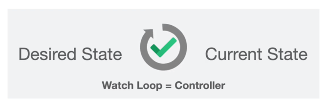

# 1. Getting Started

The goal here is to master Kubernetes from A to Z.

## 1.1. What is Kubernetes

Kubernetes is the world's most popular open-source container orchestration engine.

It offers the ability to schedule and manage containers.

### 1.1.1. Origin

- Originated from Google.
- Started with a system called Borg which allowed them to deploy billions of containers every week.
- From Borg, they developed Omega.
- From Omega, Kubernetes was born.
- Kubernetes is written in Golang.

### 1.1.2. Kubernetes AKA K8S


- Kubernetes means Helmsman or Pilot in Greek.
- You can imagine it as a ship carrying cargo (containers).
- Kubernetes, or K8S (8 because there are 8 letters between K and S in Kubernetes) is an application orchestrator.
- Basically, Kubernetes orchestrates all the applications.

### 1.1.3. Application Orchestrator


- When we are talking about applications, we mainly refer to **containers**.
- Kubernetes deploys and manages applications (containers).
- It also scales up and down according to demand.
- Performs zero downtime deployments.
- Allows rollbacks.
- Much more.

### 1.1.4. Cluster


- To understand how Kubernetes works, we first need to understand what a cluster is.
- Cluster is a set of nodes.
- Node can be a virtual machine (VM) or a physical machine, which can be run on AWS, Azure or Google Cloud.

### 1.1.5. Kubernetes Cluster


- In Kubernetes Cluster, there is a difference between the Master Node and the Worker Node.
  - **Master Node:**
    - Brains of the cluster.
    - Place where all the control and decisions are made.
    - Master Node runs all cluster's control plane services.
  - **Worker Node:**
    - Place where all the heavy lifting stuff happens, such as running the applications.
- Both the Master Node and Worker Node communicate with each other through something called a **kubelet**.
- Within a cluster, there is usually more than one worker node.

## 1.2. Master Node and Control Plane


- Master Node contains something called a Control Plane.
- The Control Plane is made of several components:
  - API Server
  - Scheduler
  - Cluster Store
  - Controller Manager
  - Cloud Controller Manager (talks to underlying cloud provider API such as AWS, Google Cloud, Azure etc)
- All of these components within the Master Node communicate via the API Server.
- Worker Nodes are outside the bounds of the Control Plane.

### 1.2.1. API Server


- API Server is the Frontend to the Kubernetes Control Plane.
- All (both External and Internal) communications go through API server.
- Exposes RESTful API on port 443.
- In order for it to talk to the API, authentication and authorization checks are performed.

### 1.2.2. Cluster Store (state etcd)


- Contains all of the state for our application.
- Stores configuration and state of the entire cluster.
- Kubernetes currently uses **etcd** which is a Distributed Key Value data store.
- In essence, **etcd** is a single-source-of-truth (like a database).

### 1.2.3. Scheduler

- Watches for new workloads/pods and assigns them to a node based on several scheduling factors.
- Is the node healthy?
- Does it have enough resources?
- Is the port available?
- Affinity and anti-affinity rules.
- Other important factors.

### 1.2.4. Controller Manager



- Daemon that manages the control loop.
- Basically it's a controller of controllers.
- In Kubernetes there are a bunch of controllers, such as Node Controller.
- Each Controller Manager watches the API Server for changes, with goal to watch for any changes that do not match our desired state.

#### 1.2.4.1. Node Controller


  
- Whenever the current state doesn't match the desired state, Node Controller then reacts to those changes.
- For example, if a node dies for whatever reason, the Node Controller is responsible for bringing another node.

#### 1.2.4.2. ReplicaSet Controller

- Responsible for ensuring that we have the correct number of ports running.

#### 1.2.4.3. Endpoint Controller

- This controller assigns ports to services.

#### 1.2.4.4. Namespace Controller

- Provides a mechanism for isolating groups of resources within a single cluster.

#### 1.2.4.5. Service Accounts Controller

- Provides an identity for processes that run in a Pod.

### 1.2.5. Cloud Controller Manager


- Responsible for interacting with the underlying cloud provider (such as AWS, Azure, Google Cloud).


- The configuration shown above, `ingress.yml` file, contains an Ingress and this gives us a Load Balancer.
1. First, this request goes through the **API Server**. 
2. That request gets stored in **etcd**.
3. And then **Cloud Controller Manager** kicks in.


- Depending on where the Kubernetes is run, lets say AWS for example, then it creates a Load Balancer on AWS.
- Just how it takes care of Load Balancers, it does the same for Storage and Instances.

## 1.3. Worker Node


- It is a VM or physical machine running on Linux.
- Provides running environment for your applications.
- Inside a Worker Node, there are Pods.
- Pod is a container in the Docker world.
- When deploying applications, we should really be deploying Microservices.


- The Worker Node has 3 main components:
  - Kubelet (agent)
  - Container Runtime
  - Kube Proxy

### 1.3.1. Kubelet


- This is the Main Agent that runs on every single node.
- Receives Pod definitions from API Server.
- Interacts with Container Runtime to run containers associated with that Pod.
- Reports Node and Pod state to Master Node through the API Server.

### 1.3.2. Container Runtime


- Responsible for pulling images from container registries such as:
  - **Docker Hub**
  - **GCR** (Google Container Registry)
  - **ECR** (Amazon Elastic Container Registry)
  - **ACR** (Azure Container Registry)
- After pulling the images, it's also responsible for starting containers from those images and also stopping containers.
- Abstracts container management for Kubernetes.
- Within it, we have a Container Runtime Interface (CRI).
  - This is an interface for 3rd party container runtimes.

### 1.3.3. Kube Proxy

- Agent that runs on every node through a DaemonSet.
- Responsible for:
  - Local cluster networking.
  - Each node gets its own unique IP address.
  - Routing network traffic to load balanced services.
- For example
  1. If two Pods want to talk to each other, Kube Proxy will handle that.
  2. If you as a client want to send a request to your cluster, Kube Proxy will handle all of that.

## 1.4. Running Kubernetes Clusters

There are a couple of ways to run Kubernetes Clusters.

### 1.4.1. Running Kubernetes

There are two ways to start Kubernetes:
1. Run it yourself – which is super difficult.
2. Managed (Kubernetes) solution – this is what most companies use.
   - **EKS** – Amazon Elastic Kubernetes Service
   - **GKE** – Google Kubernetes Engine
   - **AKS** – Azure Kubernetes Service
   - Other cloud providers

### 1.4.2. Managed Kubernetes


- What does it mean to be "managed"? It means you don't have to worry about Master Node as well as all the services that are run within the Master Node, such as the Scheduler, API Server, Cluster Store, Controller Manager etc.
- All we then need to focus on are the Worker Nodes, which is where all the applications are run.

### 1.4.3. EKS


- Managed solution from AWS.
- They give you a cluster, and then you decide how you want to run your applications.
- Currently, there are 2 ways:
  - **AWS Fargate**
    - Mainly for serverless containers (applications that don't need to be running all the time).
  - **Amazon EC2**
    - This is the place where you deploy your Worker Nodes for your EKS cluster.
    - Used for long-running applications.

### 1.4.4. Running Kube Cluster Locally


- You shouldn't be using Managed Services via Cloud Providers because it's expensive – use it only for production.
- For development use a local cluster.
- To create a local cluster, there are 3 main solutions:
  - Minikube
  - Kind
  - Docker
- These solutions are for learning Kubernetes.
- Used for Local Development or CI.
- **Important note:** DO NOT USE IT IN ANY ENVIRONMENT INCLUDING PRODUCTION.

### 1.4.5. Minikube


- Has great community.
- Add-ons and lots of features.
- Great documentation.
- Installation: Docker + Minikube.
- The goal is for our machine to interact with our cluster.
  - The way to do this is to use a command line application called `kubectl`.

## 1.5. Installing Docker

The goal is to install Minikube. But prerequisite to that is to have Docker installed.

1. To install Docker navigate to https://www.docker.com/
2. Create a Docker Hub account and make sure you can create repositories here https://hub.docker.com/
3. Test Docker version with command:
```console
docker --version
```
4. Pull a starter Docker image:
```console
docker run -d -p 80:80 docker/getting-started
```
5. Test if the container is pulled:
```console
docker ps
```
6. To see what was pulled navigate to:
```console
http://localhost
```
7. To stop a container:
```console
docker stop <container-id>
```
8. To remove a container which was stopped:
```console
docker rm <container-id>
```

## 1.6. Installing Minikube

Once you have Docker installed, it's time to install Minikube.

1. To install Minikube navigate to https://minikube.sigs.k8s.io/docs/
2. Open **Get Started** tab https://minikube.sigs.k8s.io/docs/start/
3. To get Minikube installed on a Mac use command:
```console
brew install minikube
```
4. Test Minikube version with command:
```console
minikube version
```
5. Start a Minikube cluster with command:
```console
minikube start
```
6. Check Minikube status with command:
```console
minikube status
```
7. Now you should successfully have a Kubernetes Cluster running on your local machine.

## 1.7. Installing KUBECTL

- What we want to do is to interact from our machine with the cluster.
- A way to do it is by using a command line application called `kubectl`.
- `kubectl` is a Kubernetes command line tool.
- Run commands against your cluster.
  - Deploy
  - Inspect
  - Edit resources
  - Debug
  - View logs
  - Etc

1. To install `kubectl` navigate to https://kubernetes.io/docs/tasks/tools/
2. For Mac go to https://kubernetes.io/docs/tasks/tools/install-kubectl-macos/
3. Follow the docs. But in short, to install it use this command:
```console
curl -LO "https://dl.k8s.io/release/$(curl -L -s https://dl.k8s.io/release/stable.txt)/bin/darwin/amd64/kubectl"
```
4. Make the `kubectl` binary executable:
```console
chmod +x ./kubectl
```
5. Move the `kubectl` binary to a file location on your system PATH:
```console
sudo mv ./kubectl /usr/local/bin/kubectl
```
6. Chown it to root privileges:
```console
sudo chown root: /usr/local/bin/kubectl
```
7. Test the details and version:
```console
kubectl version --output=yaml
```

## 1.8. Kubernetes Hello World


- What we want to do is execute a `kubectl` command against our API Server, and let the Scheduler and API Server do its thing.
- Doing this will automatically create a Pod for us.
- A Pod is a collection of 1 or more containers.

1. First make sure the Docker is up and running:
```console
docker run --rm -p 80:80 nginx
```
2. This is currently running on Docker. To confirm this works navigate to:
```console
http://localhost:8080/
```
3. To run it via Kubernetes:
```console
kubectl run hello-world --image=nginx --port=80
```
4. A new Pod was just created. To verify this use command:
```console
kubectl get pods
```
5. To access this pod:
```console
kubectl port-forward pod/hello-world pod/hello-world 8080:80
```
6. Now the application is deployed using Kubernetes. To confirm this works navigate to:
```console
http://localhost:8080/
```
7. To delete a Pod:
```console
kubectl delete pods hello-world
```

# 2. Exploring K8S Cluster

Let's explore the components that make up the Control Plane, how you can view the Nodes etc.

## 2.1. Exploring Cluster

Currently, we only have 1 node and that is the Master Node.

1. To see all available nodes use command:
```console
kubectl get nodes
```
2. At this point there should be no existing pods in the default namespace. To verify this use command:
```console
kubectl get pods
```
3. To view ALL pods from ALL namespaces use command:
```console
kubectl get pods -A
```
4. Let's create a new Pod again:
```console
kubectl run hello-world --image=nginx --port=80
```
5. Verify the Pod was created:
```console
kubectl get pods
```
6. View again ALL the pods in ALL namespaces:
```console
kubectl get pods -A
```

## 2.2. SSH Into Nodes

1. View all nodes:
```console
kubectl get nodes
```
2. To SSH into the available node, use command:
```console
minikube ssh
```
3. You can then see the directory you landed in using the command:
```console
pwd
```
4. Or go to root directory
```console
cd /
```
5. List everything from root
```console
ls
```
6. See all binaries:
```console
ls bin
```
7. Check Docker version which was installed in this node:
```console
docker --version
```
8. View Docker containers running in this node:
```console
docker ps
```

## 2.3. Starting and Stopping Clusters

Let's see how we can stop and delete a Kubernetes cluster, as well as creating a cluster with 2 nodes.

1. Make sure the cluster is running:
```console
minikube status
```
2. To stop a cluster, while keeping all the configuration and settings, use command:
```console
minikube stop
```
3. Check again to verify the cluster was stopped:
```console
minikube status
```
4. To start the cluster again, use command:
```console
minikube start
```
5. Check again if the cluster is successfully running:
```console
minikube status
```
6. If you want to delete the cluster completely (not only to stop it), use command:
```console
minikube delete
```

## 2.4. Cluster with 2 Nodes

Let's use a Minikube to start a cluster with 2 nodes.

1. To create a cluster with 2 nodes, use command:
```console
minikube start --nodes=2
```
2. Now verify if there are 2 clusters using the command:
```console
minikube status
```
3. Verify there are 2 nodes using the command:
```console
minikube get nodes
```
4. Check the IP address of the Master Node. If we don't specify which node, it will default to the Master Node:
```console
minikube ip
```
5. If we want to get the IP of a specific node, use command:
```console
minikube ip --node=minikube-m02
```

## 2.5. Minikube Logs

Checking logs of nodes can be used to debug them, or just track the node log information.

1. Check logs for the Master Node:
```console
minikube logs
```
2. Follow the logs in real time as they happen:
```console
minikube logs -f
```
3. Check all nodes and make sure there is more than one available:
```console
kubectl get nodes
```
4. Get logs of a specific node:
```console
minikube logs --node=minikube-m02
```

# 3. Pods

## 3.1. Pods


- In Kubernetes, Pod is the smallest deployable unit (not a container).
- Within a Pod, there is always 1 main container.
- The main container represents your application, whether it was written in NodeJS, JavaScript, Golang, etc.
- You may or may not have an **Init Container**, which are executed before the **main container**.
- Next, you may or may not have **Side Containers**.
  - You can have 1 or 2 or however many you want, and also some side language (python, java, etc).
  - Side containers are containers that support your Main Container.
  - For example, you might have a side container that acts as a proxy to your main container.
- Within Pods, you can have **Volumes**, and this is how containers share data between them.
- The way these containers communicate with each other within a Pod, is through localhost and whatever port they expose to.
- Every Pod itself has a unique IP address, which means if another Pod wants to talk to this Pod, it uses the unique IP address.
- So, a Pod is a group of 1 or more containers.
- Represents a running process.
- Shares the same network and volumes.
- Never create Pods on its own – use controllers instead.
- Pods are ephemeral (short-lived) and disposable.

### 3.1.1. Smallest Deployable Unit


- **For Docker**, smallest deployable unit are Containers.
- **For Kubernetes**, smallest deployable unit are Pods.

## 3.2. Imperative vs Declarative Management

- Pods can be created using an **imperative** command such as:
```console
kubectl run hello-world --image=nginx --port=80
```
- The other approach is to use a declarative configuration.
- Declarative configuration defines the exact same command as imperative, but it's using a configuration (usually `.yml`) file such as:
```yml
apiVersion: v1
kind: Pod
metadata:
  name: hello-world
  labels:
    app: hello-world
spec:
  containers:
    - name: hello-world
      image: nginx
      resources:
        limits:
          memory: "128Mi"
          cpu: "500m"
      ports:
        - containerPort: 80
```

### 3.2.1. Declarative vs Imperative Configuration

- **Imperative:**
  - Should be used mainly for learning purposes.
  - When you want to troubleshoot something.
  - Experimenting with something within the cluster.
- **Declarative:**
  - Reproducible, meaning you can take the same configuration and apply it in multiple different environments, such as:
    - Testing environment
    - Demo environment
    - Production environment
    - Etc
  - Best practices are to use declarative configuration.

## 3.3. Create Pods Imperative Command

Let's explore how to create pods using `kubectl`.

First we'll create a Pod using **imperative** command, and then we'll declare a Pod using **declarative** configuration.

1. Pods are created in the default namespace if not specified otherwise explicitly. Make sure the `hello-world` Pod doesn't exist:
```console
kubectl get pods
```
2. Now use the **imperative** command to create the Pod:
```console
kubectl run hello-world --image=nginx --port=80
```
3. Check again and verify this newly created Pod is running:
```console
kubectl get pods
```
4. Connect to this Pod using the command:
```console
kubectl port-forward pod/hello-world 8080:80
```
5. Verify that you can access:
```console
http://localhost:8080
```

## 3.4. Create Pods Using Declarative Configuration

- Another way we can create Kubernetes objects is using a yaml file.
- Yaml is a serialization language used to format configuration files.

1. Example Pod can be found in this [pod.yml](pods/pod.yml) file.
2. Check if there is already a `hello-world` Pod:
```console
kubectl get pods
```
3. If there is a `hello-world` Pod then delete it:
```console
kubectl delete pods hello-world
```
4. Now create a Pod from **declarative** configuration file:
```console
kubectl apply -f pods/pod.yml
```
5. Connect to this Pod:
```console
kubectl port-forward pod/hello-world 8080:80
```
6. Verify that you can access:
```console
http://localhost:8080
```

## 3.5. Pod YAML Config Overview

Here is an example of a Kubernetes Pod defined in `pod.yml` file:

```yml
apiVersion: v1
# Tells Kubernetes that this is a Pod yml file
kind: Pod
metadata:
  # Name of this Pod
  name: hello-world
  labels:
    # Pod label
    app: hello-world
spec:
  # Pod is a collection of 1 or more containers
  containers:
      # This container is named 'hello-world'
    - name: hello-world
      # Image name
      image: nginx
      resources:
        # This Pod can only access a certain amount of memory and cpu
        limits:
          memory: "128Mi"
          cpu: "500m"
      ports:
          # This container is listening on port 80
        - containerPort: 80
```

# 4. KUBECTL

Let's learn about the common `kubectl` commands that we're gonna be using within our clusters.

## 4.1. Create and Delete Resources

1. Make sure to delete `hello-world` pod if it's running. To check all pods use command:
```console
kubectl get pods
```
2. To create a pod based on **declarative** configuration file, use command:
```console
kubectl apply -f pods/pod.yml
```
3. Another way to create a pod is to take the output (`cat pods/pod.yml`) and feed it into `kubectl apply`:
```console
cat pods/pod.yml | kubectl apply -f -
```
4. Verify if the pod was created:
```console
kubectl get pods
```
5. Delete an existing pod:
```console
kubectl delete pods hello-world
```
6. Verify if the pod was deleted:
```console
kubectl get pods
```

## 4.2. List resources

1. To list all pods from ALL namespaces:
```console
kubectl get pods -A
```
2. To list EVERYTHING (not just pods) within the default namespace:
```console
kubectl get all
```
3. To list EVERYTHING (not just pods) within ALL namespaces:
```console
kubectl get all -A
```
4. To search pods within a specific namespace:
```console
kubectl get pods -n kube-system
```
- `-n <namespace>` targets the namespace name.
5. Find all existing namespaces:
```console
kubectl get namespaces
```

## 4.3. KUBECTL Describe

1. Verify the `hello-world` pod is running:
```console
kubectl get pods
```
2. To view all details and information about a specific pod use:
```console
kubectl describe pods hello-world
```
3. Get a little more information about a specific pod:
```console
kubectl get pods hello-world -o wide
```

## 4.4. Formatting Output

1. Format logs as table:
```console
kubectl get pods hello-world -o wide
```
2. Format logs as yaml:
```console
kubectl get pods hello-world -o yaml
```
3. Format logs as JSON:
```console
kubectl get pods hello-world -o json
```

## 4.5. Logs

Using logs will help to debug pods, applications etc.

1. To print logs of a specific pod:
```console
kubectl logs hello-world
```
2. Follow logs (if an event happens it will be shown in real time):
```console
kubectl logs hello-world -f
```
3. If there are multiple containers in a pod, to get logs of a specific container use command: 
```console
kubectl logs hello-world -c hello-world
```

## 4.6. Shell Access To A Running Pod

Sometimes you may want to jump into container's shell and debug from within.

1. To enter a pod via terminal in interactive mode (`-it` parameter):
```console
kubectl exec -it hello-world -- bash
```
2. Or if it requires SH:
```console
kubectl exec -it hello-world -- sh
```
3. Similarly, if there are multiple containers, to enter into a specific one use the command:
```console
kubectl exec -it hello-world -c hello-world -- sh
```
- Entering into containers like this is usually used for debugging purposes.
4. You can also just execute commands from outside without entering into the container. This is called non-interactive mode. For example:
```console
kubectl exec hello-world -- ls /
```

## 4.7. Access Pod via Port Forward

Sometimes when you want to debug your application, or just want to verify if things are working, if you want to access the application that runs within your pod, you can do it using `kubectl port-forward`.

1. Connect to a pod:
```console
kubectl port-forward hello-world 8080:80
```
2. Verify that it works on:
```console
http://localhost:8080/
```
3. You can change the outer port of the pod, for example:
```console
kubectl port-forward hello-world 8081:80
```
4. Verify that it works but on port `8081` this time:
```console
http://localhost:8081/
```
5. The command `kubectl port-forward` works for other resources and not just pods (services and others).
You can also port forward by explicitly stating that it's a pod:
```console
kubectl port-forward pod/hello-world 8080:80
```

## 4.8. List All Resource Types

1. To view a list of all resources:
```console
kubectl api-resources
```

## 4.9. KUBECTL Cheatsheet

Full cheatsheet can be found on https://kubernetes.io/docs/reference/kubectl/cheatsheet/

1. See all available commands:
```console
kubectl --help
```
